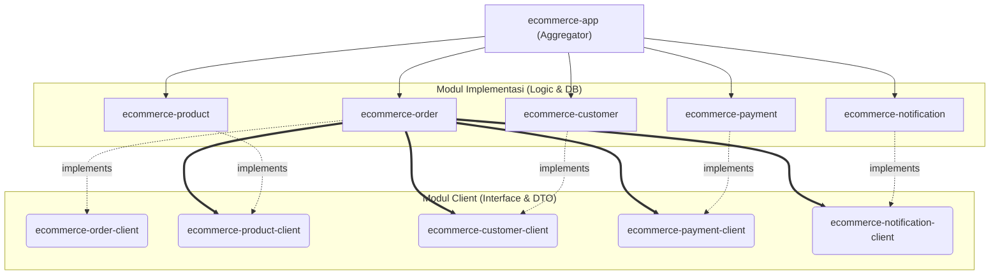

# Modular Monolith E-Commerce Demo

Proyek ini adalah demonstrasi implementasi arsitektur **Modular Monolith** menggunakan Java dan Spring Boot. Arsitektur ini menggabungkan kesederhanaan dan kemudahan *deployment* dari sebuah aplikasi monolith, dengan ketegasan pemisahan batas konteks (*bounded contexts*) yang secara umum biasa ditemukan pada arsitektur Microservices.

## Arsitektur & Diagram

Proyek ini dipisahkan berdasarkan domain bisnis ke dalam beberapa modul Maven. Untuk menjaga agar tidak terjadi ketergantungan yang kaku (*tight coupling*), setiap domain bisnis (misalnya `Order`) terbagi menjadi dua sub-modul terpisah:
1. **Modul Client (`ecommerce-order-client`)**: Berisi *Interface* kontrak pelayanan dan DTO (Data Transfer Objects / Records). Modul ini sangat ringan dan merupakan satu-satunya dependensi yang boleh di-import oleh modul lain.
2. **Modul Implementation (`ecommerce-order`)**: Berisi *logic* inti bisnis (Controller, Service, Repository, dan JPA Entity). Modul ini meng-hide (menyembunyikan) seluruh kerumitan kode maupun databasenya dari modul domain lain.

### Architecture Diagram



## Keunggulan Arsitektur: Transisi Mulus ke Microservices

Salah satu tantangan terbesar sebuah perusahaan (*startup/enterprise*) adalah menentukan kapan waktu yang tepat beralih dari Monolith ke Microservices. Seringkali perpindahan ini memakan waktu berbulan-bulan (bahkan tahun) karena kerumitan melepaskan *coupled code*.

**Modular Monolith** menjawab masalah ini. Arsitektur proyek ini memiliki keunggulan absolut di mana aplikasi ini **sangat mudah untuk dievolusikan menjadi Microservices di masa depan** tanpa harus merombak banyak baris kode.

Sebagai contoh mekanisme *Order* kita:
Saat ini, `ecommerce-order` memanggil fitur manajemen stok melalui interface murni `ProductClient` (dari `ecommerce-product-client`). Di dalam *runtime* (berkat `ecommerce-app`), Spring Framework akan otomatis menyuntikkan bean `ProductClientImpl` lokal (pemanggilan fungsi *synchronous* secara langsung ke blok memori JVM yang sama tanpa intervensi HTTP jaringan).

**Bayangkan jika besok perusahaan membesar dan modul `Product` harus dipisahkan menjadi *Microservice* tersendiri di *server* yang berbeda:**
1. **Tidak Ada Perubahan pada Modul Pemanggil (Caller)**: Modul `ecommerce-order` (beserta ratusan baris logika perhitungannya) **TIDAK PERLU DIUBAH SAMA SEKALI**. Pemanggilan seperti `productClient.reduceStock()` akan dibiarkan persis apa adanya.
2. **Cukup Ganti Implementasi Client**: Anda hanya perlu membuang `ProductClientImpl` lokal, dan membuat implementasi baru (misalnya `ProductClientRestImpl` menggunakan `RestTemplate`, `WebClient`, atau Spring Cloud `FeignClient`) agar `reduceStock()` tersebut melakukan pemanggilan API eksternal via HTTP/gRPC ke *microservice* yang baru.
3. **Database Terpisah Sejak Awal (No DB Constraints)**: Secara desain dari awal, aplikasi ini menolak penggunaan relasi *Foreign Key* lintas modul ORM (seperti `hasMany` / `@ManyToOne`). Seluruh data yang mengaitkan antar modul menggunakan identifier primitive murni (String / UUID). *Database migration* akan sangat aman untuk dipecah fisiknya ke server database lain tanpa menimbulkan *constraint violation*.

## Modul & Domain yang Tersedia

- **Customer**: Pengelolaan data profil pelanggan.
- **Product**: Manajemen katalog (*Brand*, *Category*, *Product*) beserta penyesuaian stok (*real-time stock deduction* & *restoration*).
- **Order**: Orkestrator eksekutor pesanan utama. Mampu menerima permintaan pesanan (*Create*) sekaligus menavigasi pemotongan ketersediaan stok, integrasi tagihan pembayaran, dan penembakan notifikasi. Memiliki fitur *Cancel Order* komprehensif.
- **Payment**: Penampung jejak jejak pembayaran pesanan.
- **Notification**: Modul khusus ini dibangun dengan **Event-Driven Architecture**. Modul klien (*NotificationClient*) hanya bertanggungjawab mem-publish perintah (*Spring Application Event*) tanpa mem-blokir proses utama aplikasi yang sedang berjalan, untuk kemudian diproses oleh *listener* internal dan disimpan di database.

## Tooling & Validasi Arsitektur

- **ArchUnit**: Menjadi garda terdepan pelindung arsitektur. *Unit test* (`ArchitectureTest.java`) akan memvalidasi *tight coupling*. Jika ada pengembang yang mencoba mem-bypass *Client interface* dan meng-import kelas implementasi dari modul lain secara langsung, maka proses *build* akan gagal (*Build Failure*).
- **Swagger / OpenAPI**: Semua *endpoint* dari seluruh modul otomatis tergabung dan terdokumentasi di antarmuka Swagger UI (`http://localhost:8080/swagger-ui.html`). Antarmuka ini merepresentasikan kumpulan API secara utuh layaknya *Microservices gateway*.

## Skenario Demo (Branches)

Proyek ini dilengkapi dengan beberapa *branch* yang sudah disiapkan untuk mendemonstrasikan kapabilitas Modular Monolith:

- `main`: Arsitektur *Modular Monolith* yang stabil, bersih, dan lulus semua validasi.
- `demo/architecture-test`: Mensimulasikan kesalahan (*bad practice*) di mana *developer* mencoba menembus batas modul (misal: modul `Order` memanggil `ProductService` secara langsung, bukan `ProductClient`). *Branch* ini membuktikan bagaimana **ArchUnit** akan langsung menggagalkan proses *build*. (Lihat [PR #1](https://github.com/ProgrammerZamanNow/modular-monolith-demo/pull/1))
- `demo/split-module-as-microservices`: Mendemonstrasikan betapa mudahnya memecah monolith menjadi microservices. Pada *branch* ini, implementasi modul `ecommerce-payment` **dihapus seutuhnya** dan direpresentasikan menggunakan antarmuka *HTTP RestClient*. Hasilnya: **Nol Perubahan** pada modul pemanggil (`Order`). (Lihat [PR #2](https://github.com/ProgrammerZamanNow/modular-monolith-demo/pull/2))
- `demo/event-driven-architecture`: Mensimulasikan migrasi dari arsitektur *event-driven* internal aplikasi (Spring Application Event) menjadi menggunakan Message Broker eksternal (Apache Kafka) pada modul `Notification`. Sama seperti sebelumnya, hasil akhirnya adalah **Nol Perubahan** pada modul pemanggil. (Lihat [PR #3](https://github.com/ProgrammerZamanNow/modular-monolith-demo/pull/3))

## Cara Menjalankan

Aplikasi ini dilindungi dan dijamin kelayakannya oleh jaring *Integration Testing* (*End-to-End* REST API) menggunakan *Spring Boot Web Test*.

Anda dapat menjalankan *build* dan validasi menyeluruh semua modul dan dependensinya dengan perintah standar Maven:

```bash
mvn clean verify
```
Perintah ini akan menjalankan siklus pengujian dari ujung ke ujung pada seluruh modul di dalam payung proyek ini.
